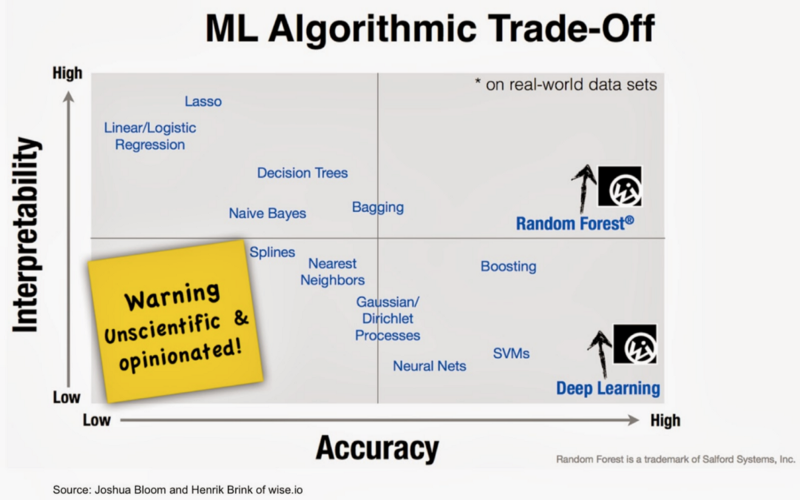
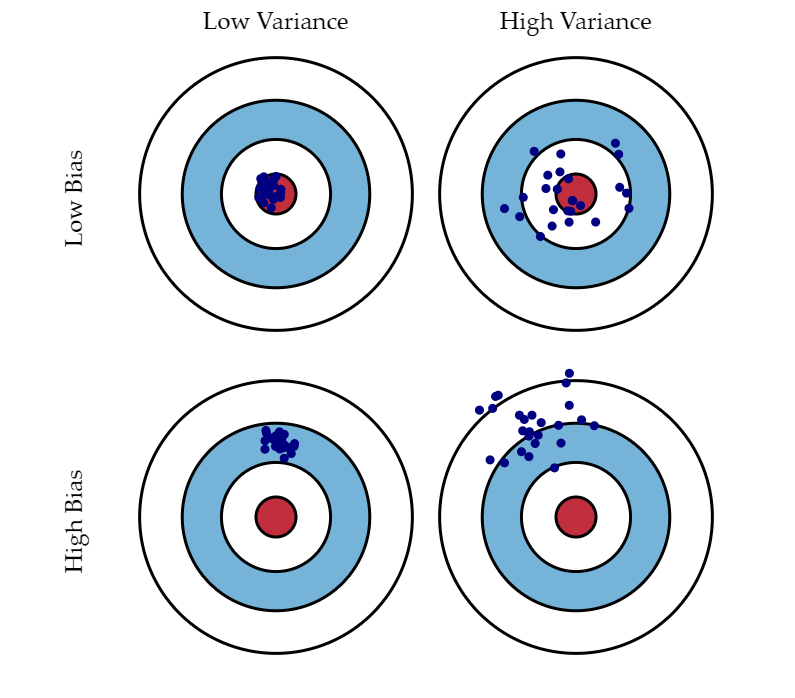

## Introduction
Given the function below - 

$$ Y = f(X) + \epsilon$$
  
$Y$ - Response / Dependent / Output variable  
$X$ - Predictor / Independent / Input variable  
$\epsilon$ - Random error with 0 mean  
  
$X$ could be a set of ($X_1,X_2 ... X_p$) variables.  
*Statistical learning* is a set of approaches used to estimate $f$ (the real relationship of $Y$ and $X$) in the above function.  
  
## Importance of $f$
  
In statistical learing the interest with $f$ broadly has 2 reasons - 

### Prediction
  
Involves predicting for $Y$ so that we arrive at -  
$$\hat{Y} = \hat{f}(X)$$  
Where $\hat{Y} and \hat{f}$ are predictions of the real $Y$ and $f$.  
For the sake of prediction, one does not require a full functional knowledge of $\hat{f}$ just so long as its accurate. Thus to a good degree $\hat{f}$ is treated as a black box here.
  
    
### Inference  
  
Here the interest lies in finding how $Y$ varies with ($X_1,X_2 ... X_p$). We wish to estimate $f$, but we are not interested in predicting $Y$. $f$ is not a black box here.  
For example we may want to know - 
  
1. What predictors are associated with resposne

2. Relationship of response with each predictor

3. Is $Y$ related to each of ($X_1,X_2 ... X_p$) linearly or is the relationship more complicated.  

## Parametric Models vs. Non-Parametric Models
  
### Parametric Models
  
Form $f$ is assumed and then estimated. For e.g. linear regression assumes a linear $f$ and then estimates $f$ (Least Square Sum of Residuals).  

These models have a finte number of parameters  regardless of the size of the data. Thus *predictions dont depend on the data*. The parameters are a finite summary of the data. This is *Model Based Learning*.

### Non-Parametric Models
  
These can allow the number of "parameters" to grow as the data grows. Thus predictions depend on the data and also on the number of "parameters". This is *Memory Based Learning*.  

## Prediction Accuracy vs. Model Predictibility  

If *Inference* is the goal, we use simpler and relatively inflexible models.  
If *Prediction* is the goal, we use more flexible models. 
  

Interpretability vs Prediction Accuracy

  
  
## Assesing Model Accuracy
  
No one statistical learning method is best across all datasets.  
In the **Regression** setting we use MSE (mean square error).  
In the **Classification** setting we use Confusion Matrix.  

Fundamentally, as model flexibility increases the -  

* training error decreases
* test error may or may not decrease  
  
## Bias and Variance
  
Are 2 contending factors that all stat models must consider.  

### Bias  
  
Is the set of simplifying assumptions made by the model to make the target function easier to learn.  
*Negative* - This is the models tendency to learn the wrong things by not considering all the data. ***UNDERFITTING***.  

* Parametric models have a high bias and typically low flexibility
* Linear Regression, Logistic Regression and LDA have high bias
* Decision Trees, KNN, SVM have low bias  
  
### Variance  
  
Is the amount by which the estimate of the target function changes if different training data was used.  
*Negative* - This is the models tendency to learn random things irrespective of real signals. ***OVERFITTING***.  

* Non-Parametric models having high flexibility have high variance
* Linear Regression, Logistic Regression and LDA low variance
* Decision Trees, KNN, SVM have high variance  
  

Bias and Variance

