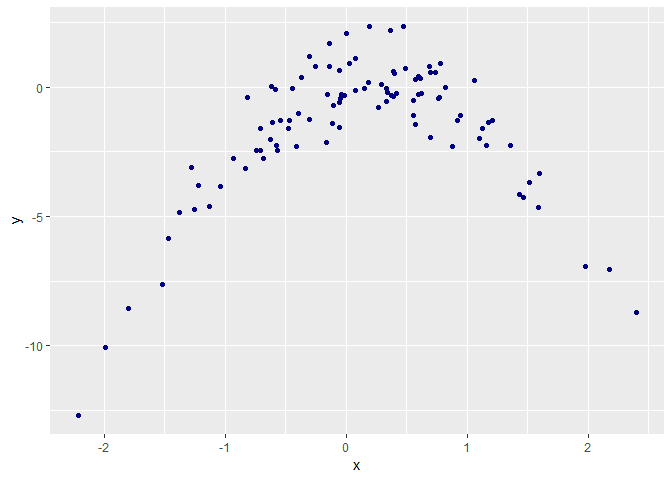

## Estimating test error for a classification model
### Data Desc.
Data set : `default`  
Model : `default ~ income + balance`

```r
library(ISLR)
summary(Default)
```

```
##  default    student       balance           income     
##  No :9667   No :7056   Min.   :   0.0   Min.   :  772  
##  Yes: 333   Yes:2944   1st Qu.: 481.7   1st Qu.:21340  
##                        Median : 823.6   Median :34553  
##                        Mean   : 835.4   Mean   :33517  
##                        3rd Qu.:1166.3   3rd Qu.:43808  
##                        Max.   :2654.3   Max.   :73554
```

### fit a model 
Fit a logistic regression model to predict `default` from `income` and `balance`

```r
attach(Default)
set.seed(1)
glm.fit = glm(default ~ income + balance, data = Default, family = binomial)
```
### validation set approach
Lets estimate the test error rate of the model  

* Split the sample set into training and validation set

```r
set.seed(1)
train = sample(dim(Default)[1], dim(Default)[1]/2)
```
  
* Fit a multiple logistic regression model using only training set

```r
glm.fit = glm(default ~ income + balance, data = Default, family = binomial, subset = train)
```
  
* Predict default status for each individual in validation set (if posterior probability of default for the individual is above 0.5 then the individual defaults)

```r
glm.pred = rep("No", dim(Default)[1]/2)
glm.probs = predict(glm.fit, Default[-train, ], type = "response")
glm.pred[glm.probs > 0.5] = "Yes"
```
* Compute the validation set error (fraction of the observations in validation set that are misclassified)

```r
mean(glm.pred != Default[-train, ]$default)
```

```
## [1] 0.0286
```
We seem to have a test error rate of 2.86% for the given split created in the validation set approach

### validation set approach with variable training and validation set
* repeat the validation set approach for the above data set using 3 different splits


```r
# defining a function with same steps as section above without the SEED to give 3 different sets and results

vsa_func = function(){
  # set.seed(1)
  train = sample(dim(Default)[1], dim(Default)[1]/2)
  
  glm.fit = glm(default ~ income + balance, data = Default, family = binomial, subset = train)
  
  glm.pred = rep("No", dim(Default)[1]/2)
  glm.probs = predict(glm.fit, Default[-train, ], type = "response")
  glm.pred[glm.probs > 0.5] = "Yes"
  
  
  mean(glm.pred != Default[-train, ]$default)
}

# result 1
vsa_func()
```

```
## [1] 0.0236
```

```r
#result 2
vsa_func()
```

```
## [1] 0.028
```

```r
#result 3
vsa_func()
```

```
## [1] 0.0268
```
We get different (variable) test error using different samples. These avg out to 0.0261333.

### Validation set approach with an additional dummy variable
Throwing in `student` into the predictors we build a new model.

```r
set.seed(1)
train = sample(dim(Default)[1],dim(Default)[1]/2)

glm.fit = glm(default~income+balance+student, data = Default, subset = train, family = binomial)

glm.pred = rep("No",length(train))
glm.probs = predict(glm.fit, Default[-train,], type = "response")
glm.pred[glm.probs>0.5]="Yes"

# Test Error
mean(glm.pred!=Default[-train,]$default)
```

```
## [1] 0.0288
```
It doesn't appear that the dummy variable is making a big difference in the test error rate.

## Booststrap estimate std. errors for regression coeff vs. std. formula
### Data Desc.
Data set : `default`  
Model : `default ~ income + balance`

```r
library(ISLR)
summary(Default)
```

```
##  default    student       balance           income     
##  No :9667   No :7056   Min.   :   0.0   Min.   :  772  
##  Yes: 333   Yes:2944   1st Qu.: 481.7   1st Qu.:21340  
##                        Median : 823.6   Median :34553  
##                        Mean   : 835.4   Mean   :33517  
##                        3rd Qu.:1166.3   3rd Qu.:43808  
##                        Max.   :2654.3   Max.   :73554
```

```r
attach(Default)
```

```
## The following objects are masked from Default (pos = 3):
## 
##     balance, default, income, student
```
### Standard error of coefficients using `summary()`
* Use `summary()` and `glm()` to find std. errors of coefficients

```r
set.seed(1)
glm.fit = glm(default~income+balance, data = Default, family = binomial)
summary(glm.fit)
```

```
## 
## Call:
## glm(formula = default ~ income + balance, family = binomial, 
##     data = Default)
## 
## Deviance Residuals: 
##     Min       1Q   Median       3Q      Max  
## -2.4725  -0.1444  -0.0574  -0.0211   3.7245  
## 
## Coefficients:
##               Estimate Std. Error z value Pr(>|z|)    
## (Intercept) -1.154e+01  4.348e-01 -26.545  < 2e-16 ***
## income       2.081e-05  4.985e-06   4.174 2.99e-05 ***
## balance      5.647e-03  2.274e-04  24.836  < 2e-16 ***
## ---
## Signif. codes:  0 '***' 0.001 '**' 0.01 '*' 0.05 '.' 0.1 ' ' 1
## 
## (Dispersion parameter for binomial family taken to be 1)
## 
##     Null deviance: 2920.6  on 9999  degrees of freedom
## Residual deviance: 1579.0  on 9997  degrees of freedom
## AIC: 1585
## 
## Number of Fisher Scoring iterations: 8
```
### Estimating standard error of coefficients using bootstrap
* Define a `boot.fn()` which takes as input the `Default` data set, index of observations. It outputs coefficient estimates for the above coefficients.


```r
boot.fn = function(data,index) return(coef(glm(default~income+balance, data = data, subset = index, family = binomial)))
```
* Use `boot()` and `boot.fn()` to estimate std. errors of logistic regression coefficients

```r
library(boot)
boot(Default,boot.fn, 50)
```

```
## 
## ORDINARY NONPARAMETRIC BOOTSTRAP
## 
## 
## Call:
## boot(data = Default, statistic = boot.fn, R = 50)
## 
## 
## Bootstrap Statistics :
##          original        bias     std. error
## t1* -1.154047e+01  1.181200e-01 4.202402e-01
## t2*  2.080898e-05 -5.466926e-08 4.542214e-06
## t3*  5.647103e-03 -6.974834e-05 2.282819e-04
```
Looks the bootstrap std errors for the coefficients are pretty close to the ones found in the `summary()`.

## LOOCV calculation without using `cv.glm()`
### Data Desc.
Data set : `Weekly`
Model : `Direction ~ Lag1 + Lag2`

```r
library(ISLR)
summary(Weekly)
```

```
##       Year           Lag1               Lag2               Lag3         
##  Min.   :1990   Min.   :-18.1950   Min.   :-18.1950   Min.   :-18.1950  
##  1st Qu.:1995   1st Qu.: -1.1540   1st Qu.: -1.1540   1st Qu.: -1.1580  
##  Median :2000   Median :  0.2410   Median :  0.2410   Median :  0.2410  
##  Mean   :2000   Mean   :  0.1506   Mean   :  0.1511   Mean   :  0.1472  
##  3rd Qu.:2005   3rd Qu.:  1.4050   3rd Qu.:  1.4090   3rd Qu.:  1.4090  
##  Max.   :2010   Max.   : 12.0260   Max.   : 12.0260   Max.   : 12.0260  
##       Lag4               Lag5              Volume       
##  Min.   :-18.1950   Min.   :-18.1950   Min.   :0.08747  
##  1st Qu.: -1.1580   1st Qu.: -1.1660   1st Qu.:0.33202  
##  Median :  0.2380   Median :  0.2340   Median :1.00268  
##  Mean   :  0.1458   Mean   :  0.1399   Mean   :1.57462  
##  3rd Qu.:  1.4090   3rd Qu.:  1.4050   3rd Qu.:2.05373  
##  Max.   : 12.0260   Max.   : 12.0260   Max.   :9.32821  
##      Today          Direction 
##  Min.   :-18.1950   Down:484  
##  1st Qu.: -1.1540   Up  :605  
##  Median :  0.2410             
##  Mean   :  0.1499             
##  3rd Qu.:  1.4050             
##  Max.   : 12.0260
```

```r
attach(Weekly)
```


### Fit a logistinc regression model to predict `Direction` using `Lag1 + Lag2`

```r
glm.fit = glm(Direction~Lag1+Lag2, data = Weekly, family = binomial)
summary(glm.fit)
```

```
## 
## Call:
## glm(formula = Direction ~ Lag1 + Lag2, family = binomial, data = Weekly)
## 
## Deviance Residuals: 
##    Min      1Q  Median      3Q     Max  
## -1.623  -1.261   1.001   1.083   1.506  
## 
## Coefficients:
##             Estimate Std. Error z value Pr(>|z|)    
## (Intercept)  0.22122    0.06147   3.599 0.000319 ***
## Lag1        -0.03872    0.02622  -1.477 0.139672    
## Lag2         0.06025    0.02655   2.270 0.023232 *  
## ---
## Signif. codes:  0 '***' 0.001 '**' 0.01 '*' 0.05 '.' 0.1 ' ' 1
## 
## (Dispersion parameter for binomial family taken to be 1)
## 
##     Null deviance: 1496.2  on 1088  degrees of freedom
## Residual deviance: 1488.2  on 1086  degrees of freedom
## AIC: 1494.2
## 
## Number of Fisher Scoring iterations: 4
```

### Fit a logistic regression model that has the same framework but does not use the first observation

```r
glm.fit = glm(Direction~Lag1+Lag2, data = Weekly, family = binomial, subset = -1)
summary(glm.fit)
```

```
## 
## Call:
## glm(formula = Direction ~ Lag1 + Lag2, family = binomial, data = Weekly, 
##     subset = -1)
## 
## Deviance Residuals: 
##     Min       1Q   Median       3Q      Max  
## -1.6258  -1.2617   0.9999   1.0819   1.5071  
## 
## Coefficients:
##             Estimate Std. Error z value Pr(>|z|)    
## (Intercept)  0.22324    0.06150   3.630 0.000283 ***
## Lag1        -0.03843    0.02622  -1.466 0.142683    
## Lag2         0.06085    0.02656   2.291 0.021971 *  
## ---
## Signif. codes:  0 '***' 0.001 '**' 0.01 '*' 0.05 '.' 0.1 ' ' 1
## 
## (Dispersion parameter for binomial family taken to be 1)
## 
##     Null deviance: 1494.6  on 1087  degrees of freedom
## Residual deviance: 1486.5  on 1085  degrees of freedom
## AIC: 1492.5
## 
## Number of Fisher Scoring iterations: 4
```
### Use the above model to repdict direction of 1st observation

```r
glm.pred = "Down"

glm.probs = predict(glm.fit,Weekly,type = "response")[1]

# Prediction
glm.pred[glm.probs>0.5]="Up"

# 1st obs direction
Weekly$Direction[1]
```

```
## [1] Down
## Levels: Down Up
```
Prediction was incorrect with prediction being 'Up' but actual Direction being 'Down'.

### `for()` to perform LOOCV 
Follow the steps below to perform LOOCV without the `cv.glm()` function. LOOCV estimate for the test error is in the next section.
Perform the following steps -  

* Fit the logistic regression model using all but $i^{th}$ observation
* Compute Posterior probability of the market moving up or down for $i^{th}$ observation
* Use the posterior probability for $i^{th}$ observation to predict market going up or down
* Create an error flag that houses value 1 for incorrect prediction and 0 for correct


```r
count = rep(0,dim(Weekly)[1])
for(i in 1:dim(Weekly)[1]){
  glm.fit = glm(Direction ~ Lag1 + Lag2, data = Weekly, family = binomial, subset = -i)
  is_up = predict(glm.fit,Weekly[i,], type = "response")>0.5
  is_true_up = Weekly[i,]$Direction == "Up"
  count[i] = ifelse(is_up == is_true_up, 0,1)
}
sum(count)
```

```
## [1] 490
```
This indicates that 490 observations of 1089 were incorrectly classified.

### Average out the n numbers to find LOOCV estimate for test error


```r
mean(count)
```

```
## [1] 0.4499541
```
Suggests a LOOCV estimate for test error to be 45%

## Cross Validation on simulated data
### Generate data


```r
set.seed(1)
x = rnorm(100)
y = x-2*x^2+rnorm(100)
```
In this data we have `n = 100` and `p = 2` and is of the form

$$Y = X - 2X^2 + \epsilon$$

### Scatter Plot of X vs. y

```
## Warning: package 'tidyverse' was built under R version 3.5.2
```

```
## -- Attaching packages ---------------------------------------------------------------------------------------- tidyverse 1.2.1 --
```

```
## v ggplot2 3.0.0     v purrr   0.2.5
## v tibble  1.4.2     v dplyr   0.7.6
## v tidyr   0.8.1     v stringr 1.3.1
## v readr   1.1.1     v forcats 0.3.0
```

```
## Warning: package 'forcats' was built under R version 3.5.2
```

```
## -- Conflicts ------------------------------------------------------------------------------------------- tidyverse_conflicts() --
## x dplyr::filter() masks stats::filter()
## x dplyr::lag()    masks stats::lag()
```

```r
data.frame( x = x , y = y) %>% 
  ggplot(aes(x,y)) + geom_point(color = 'navy')
```

<!-- -->
  
This a quadratic plot and thus shows a curve. Negative sign on the quadratic term makes the plot an inverted U. Centered near 0 (actually at 0 + $\epsilon$).

### Set a random seed and compute LOOCV errors arising from fitting models using least squares

#### Model 1 - $$ Y = \beta_0 + \beta_1 X + \epsilon$$
#### Model 2 - $$ Y = \beta_0 + \beta_1 X + \beta_2 X^2 + \epsilon$$
#### Model 3 - $$ Y = \beta_0 + \beta_1 X + \beta_2 X^2 + \beta_3 X^3 + \epsilon$$
#### Model 4 - $$ Y = \beta_0 + \beta_1 X + \beta_2 X^2 + \beta_3 X^3 + \beta_4 X^4 + \epsilon$$


```r
df = data.frame(X = x, Y = y)

set.seed(1)
# cv.err = rep(0,4)
for(i in 1:4){
  
  glm.fit = glm( Y ~ poly(X,i), data = df)
  cv.err = cv.glm(data = df, glmfit = glm.fit)
  print(cv.err$delta[1])
}
```

```
## [1] 7.288162
## [1] 0.9374236
## [1] 0.9566218
## [1] 0.9539049
```

### Repeat above with a different seed
* Comment on the results

```r
df = data.frame(X = x, Y = y)

set.seed(10)
# cv.err = rep(0,4)
for(i in 1:4){
  
  glm.fit = glm( Y ~ poly(X,i), data = df)
  cv.err = cv.glm(data = df, glmfit = glm.fit)
  print(cv.err$delta[1])
}
```

```
## [1] 7.288162
## [1] 0.9374236
## [1] 0.9566218
## [1] 0.9539049
```

Looks like the LOOCV estimates are the same and rightly so since it estimates considering `n-1` obs each iteration.

The lowest LOOCV error arises from the quadratic fit and this is natural as it is more close to the true form of Y (recollect setting Y with the formula).

### Comment on Stat significance of coef estimates that results in fitting each of the four models 


```r
set.seed(1)
# cv.err = rep(0,4)
for(i in 1:4){
  
  glm.fit = glm( Y ~ poly(X,i), data = df)
  print(summary(glm.fit)$coefficients[,4])
  print(summary(glm.fit))
  print('~~~~~~~~~~~~~~~~~~~~~~~~~~~~~~~~~~~~~~~~~~~~~~~~~~~~~~~~~~~~~~~~~~')
}
```

```
##  (Intercept)   poly(X, i) 
## 3.953542e-08 1.923846e-02 
## 
## Call:
## glm(formula = Y ~ poly(X, i), data = df)
## 
## Deviance Residuals: 
##     Min       1Q   Median       3Q      Max  
## -9.5161  -0.6800   0.6812   1.5491   3.8183  
## 
## Coefficients:
##             Estimate Std. Error t value Pr(>|t|)    
## (Intercept)   -1.550      0.260  -5.961 3.95e-08 ***
## poly(X, i)     6.189      2.600   2.380   0.0192 *  
## ---
## Signif. codes:  0 '***' 0.001 '**' 0.01 '*' 0.05 '.' 0.1 ' ' 1
## 
## (Dispersion parameter for gaussian family taken to be 6.760719)
## 
##     Null deviance: 700.85  on 99  degrees of freedom
## Residual deviance: 662.55  on 98  degrees of freedom
## AIC: 478.88
## 
## Number of Fisher Scoring iterations: 2
## 
## [1] "~~~~~~~~~~~~~~~~~~~~~~~~~~~~~~~~~~~~~~~~~~~~~~~~~~~~~~~~~~~~~~~~~~"
##  (Intercept)  poly(X, i)1  poly(X, i)2 
## 2.656229e-29 4.184810e-09 4.584330e-44 
## 
## Call:
## glm(formula = Y ~ poly(X, i), data = df)
## 
## Deviance Residuals: 
##     Min       1Q   Median       3Q      Max  
## -1.9650  -0.6254  -0.1288   0.5803   2.2700  
## 
## Coefficients:
##             Estimate Std. Error t value Pr(>|t|)    
## (Intercept)  -1.5500     0.0958  -16.18  < 2e-16 ***
## poly(X, i)1   6.1888     0.9580    6.46 4.18e-09 ***
## poly(X, i)2 -23.9483     0.9580  -25.00  < 2e-16 ***
## ---
## Signif. codes:  0 '***' 0.001 '**' 0.01 '*' 0.05 '.' 0.1 ' ' 1
## 
## (Dispersion parameter for gaussian family taken to be 0.9178258)
## 
##     Null deviance: 700.852  on 99  degrees of freedom
## Residual deviance:  89.029  on 97  degrees of freedom
## AIC: 280.17
## 
## Number of Fisher Scoring iterations: 2
## 
## [1] "~~~~~~~~~~~~~~~~~~~~~~~~~~~~~~~~~~~~~~~~~~~~~~~~~~~~~~~~~~~~~~~~~~"
##  (Intercept)  poly(X, i)1  poly(X, i)2  poly(X, i)3 
## 4.995066e-29 4.971565e-09 1.216703e-43 7.843990e-01 
## 
## Call:
## glm(formula = Y ~ poly(X, i), data = df)
## 
## Deviance Residuals: 
##     Min       1Q   Median       3Q      Max  
## -1.9765  -0.6302  -0.1227   0.5545   2.2843  
## 
## Coefficients:
##              Estimate Std. Error t value Pr(>|t|)    
## (Intercept)  -1.55002    0.09626 -16.102  < 2e-16 ***
## poly(X, i)1   6.18883    0.96263   6.429 4.97e-09 ***
## poly(X, i)2 -23.94830    0.96263 -24.878  < 2e-16 ***
## poly(X, i)3   0.26411    0.96263   0.274    0.784    
## ---
## Signif. codes:  0 '***' 0.001 '**' 0.01 '*' 0.05 '.' 0.1 ' ' 1
## 
## (Dispersion parameter for gaussian family taken to be 0.9266599)
## 
##     Null deviance: 700.852  on 99  degrees of freedom
## Residual deviance:  88.959  on 96  degrees of freedom
## AIC: 282.09
## 
## Number of Fisher Scoring iterations: 2
## 
## [1] "~~~~~~~~~~~~~~~~~~~~~~~~~~~~~~~~~~~~~~~~~~~~~~~~~~~~~~~~~~~~~~~~~~"
##  (Intercept)  poly(X, i)1  poly(X, i)2  poly(X, i)3  poly(X, i)4 
## 5.169227e-29 4.590732e-09 1.593826e-43 7.836207e-01 1.930956e-01 
## 
## Call:
## glm(formula = Y ~ poly(X, i), data = df)
## 
## Deviance Residuals: 
##     Min       1Q   Median       3Q      Max  
## -2.0550  -0.6212  -0.1567   0.5952   2.2267  
## 
## Coefficients:
##              Estimate Std. Error t value Pr(>|t|)    
## (Intercept)  -1.55002    0.09591 -16.162  < 2e-16 ***
## poly(X, i)1   6.18883    0.95905   6.453 4.59e-09 ***
## poly(X, i)2 -23.94830    0.95905 -24.971  < 2e-16 ***
## poly(X, i)3   0.26411    0.95905   0.275    0.784    
## poly(X, i)4   1.25710    0.95905   1.311    0.193    
## ---
## Signif. codes:  0 '***' 0.001 '**' 0.01 '*' 0.05 '.' 0.1 ' ' 1
## 
## (Dispersion parameter for gaussian family taken to be 0.9197797)
## 
##     Null deviance: 700.852  on 99  degrees of freedom
## Residual deviance:  87.379  on 95  degrees of freedom
## AIC: 282.3
## 
## Number of Fisher Scoring iterations: 2
## 
## [1] "~~~~~~~~~~~~~~~~~~~~~~~~~~~~~~~~~~~~~~~~~~~~~~~~~~~~~~~~~~~~~~~~~~"
```
This shows in the (higher order summary) that the quadratic and linear terms have high statistical significance. Goes hand in hand with the LOOCV test estimate results.

## Bootstrap Estimate on `Boston` data
### Provide estimate for population mean $\hat{\mu}$ based on the data set


```r
library(MASS)
attach(Boston)
dim(Boston)
```

```
## [1] 506  14
```

```r
summary(Boston)
```

```
##       crim                zn             indus            chas        
##  Min.   : 0.00632   Min.   :  0.00   Min.   : 0.46   Min.   :0.00000  
##  1st Qu.: 0.08204   1st Qu.:  0.00   1st Qu.: 5.19   1st Qu.:0.00000  
##  Median : 0.25651   Median :  0.00   Median : 9.69   Median :0.00000  
##  Mean   : 3.61352   Mean   : 11.36   Mean   :11.14   Mean   :0.06917  
##  3rd Qu.: 3.67708   3rd Qu.: 12.50   3rd Qu.:18.10   3rd Qu.:0.00000  
##  Max.   :88.97620   Max.   :100.00   Max.   :27.74   Max.   :1.00000  
##       nox               rm             age              dis        
##  Min.   :0.3850   Min.   :3.561   Min.   :  2.90   Min.   : 1.130  
##  1st Qu.:0.4490   1st Qu.:5.886   1st Qu.: 45.02   1st Qu.: 2.100  
##  Median :0.5380   Median :6.208   Median : 77.50   Median : 3.207  
##  Mean   :0.5547   Mean   :6.285   Mean   : 68.57   Mean   : 3.795  
##  3rd Qu.:0.6240   3rd Qu.:6.623   3rd Qu.: 94.08   3rd Qu.: 5.188  
##  Max.   :0.8710   Max.   :8.780   Max.   :100.00   Max.   :12.127  
##       rad              tax           ptratio          black       
##  Min.   : 1.000   Min.   :187.0   Min.   :12.60   Min.   :  0.32  
##  1st Qu.: 4.000   1st Qu.:279.0   1st Qu.:17.40   1st Qu.:375.38  
##  Median : 5.000   Median :330.0   Median :19.05   Median :391.44  
##  Mean   : 9.549   Mean   :408.2   Mean   :18.46   Mean   :356.67  
##  3rd Qu.:24.000   3rd Qu.:666.0   3rd Qu.:20.20   3rd Qu.:396.23  
##  Max.   :24.000   Max.   :711.0   Max.   :22.00   Max.   :396.90  
##      lstat            medv      
##  Min.   : 1.73   Min.   : 5.00  
##  1st Qu.: 6.95   1st Qu.:17.02  
##  Median :11.36   Median :21.20  
##  Mean   :12.65   Mean   :22.53  
##  3rd Qu.:16.95   3rd Qu.:25.00  
##  Max.   :37.97   Max.   :50.00
```

```r
mean.medv = mean(medv)
print(mean.medv)
```

```
## [1] 22.53281
```
  Population mean from the data set is about 22.53  
  
### Provide estimate for std error of $\hat{\mu}$


```r
err.medv = sd(medv)/sqrt(length(medv))
print(err.medv)
```

```
## [1] 0.4088611
```
  Standard error is computed at 0.4089  

### Provide estimate for std error for $\hat{\mu}$ using boostrap


```r
library(boot)
boot.fn = function(data,index) return(mean(data[index]))

btsrap = boot(medv,boot.fn,1000)
btsrap
```

```
## 
## ORDINARY NONPARAMETRIC BOOTSTRAP
## 
## 
## Call:
## boot(data = medv, statistic = boot.fn, R = 1000)
## 
## 
## Bootstrap Statistics :
##     original      bias    std. error
## t1* 22.53281 0.008517589   0.4119374
```
  
The bootstrap est. of the std error is 0.4119. This is same up to 2 significant digits with 0.4089.

### Provide 95% confidence interval for $\hat{\mu}$. Compare it to `t.test(Boston$medv)`

```r
# Confidence interval using bootstrap for population mean
c(mean.medv-2*0.4119, mean.medv+2*0.4119)
```

```
## [1] 21.70901 23.35661
```

```r
t.test(medv)
```

```
## 
## 	One Sample t-test
## 
## data:  medv
## t = 55.111, df = 505, p-value < 2.2e-16
## alternative hypothesis: true mean is not equal to 0
## 95 percent confidence interval:
##  21.72953 23.33608
## sample estimates:
## mean of x 
##  22.53281
```
  
It seems that the 95% confidence interval is tad narrower by 0.02 than the bootstrap confidence interval.

### Provide an estimate for median medv $\hat{\mu}_{med}$
  

```r
med.medv = median(medv)
med.medv
```

```
## [1] 21.2
```

### Find std. error for median using bootstrap
There is no direct way to achieve this and thus we use bootstrap to estimate error involved with population median for medv $\hat{\mu}_{med}$


```r
boot.fn = function(data,index) return(median(data[index]))
boot(medv,boot.fn,1000)
```

```
## 
## ORDINARY NONPARAMETRIC BOOTSTRAP
## 
## 
## Call:
## boot(data = medv, statistic = boot.fn, R = 1000)
## 
## 
## Bootstrap Statistics :
##     original  bias    std. error
## t1*     21.2 -0.0098   0.3874004
```
  The standard error for $\hat{\mu}_{med}$ comes out at 0.3801. This is a small value compared to the value of the median itself.
  
### Provide an estimate for 10th percentile of medv $\hat{\mu}_{0.1}$

```r
medv.10 = quantile(medv,0.1)
medv.10
```

```
##   10% 
## 12.75
```


### Boostrap estimate of $\hat{\mu}_{0.1}$

```r
boot.fn = function(data,index) return(quantile(data[index],0.1))
set.seed(1)
boot(data = medv, statistic = boot.fn,1000)
```

```
## 
## ORDINARY NONPARAMETRIC BOOTSTRAP
## 
## 
## Call:
## boot(data = medv, statistic = boot.fn, R = 1000)
## 
## 
## Bootstrap Statistics :
##     original  bias    std. error
## t1*    12.75 0.01005    0.505056
```
$\hat{\mu}_{0.1}$ is 12.75 with 0.51 std. error.
