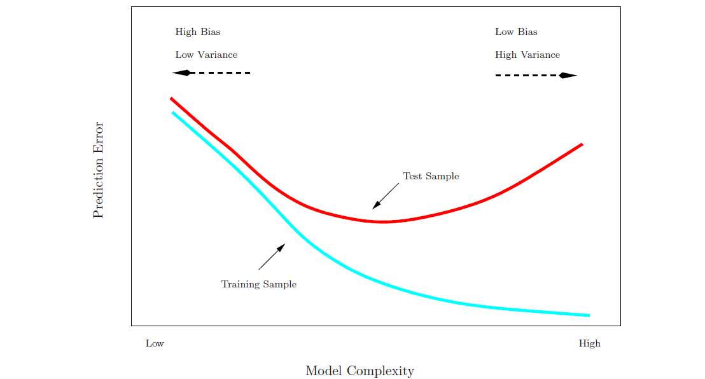
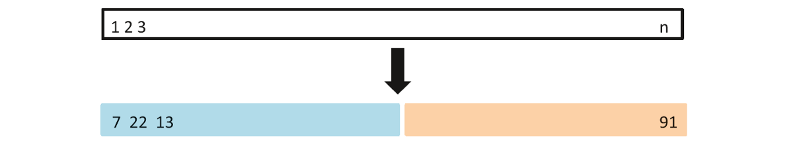
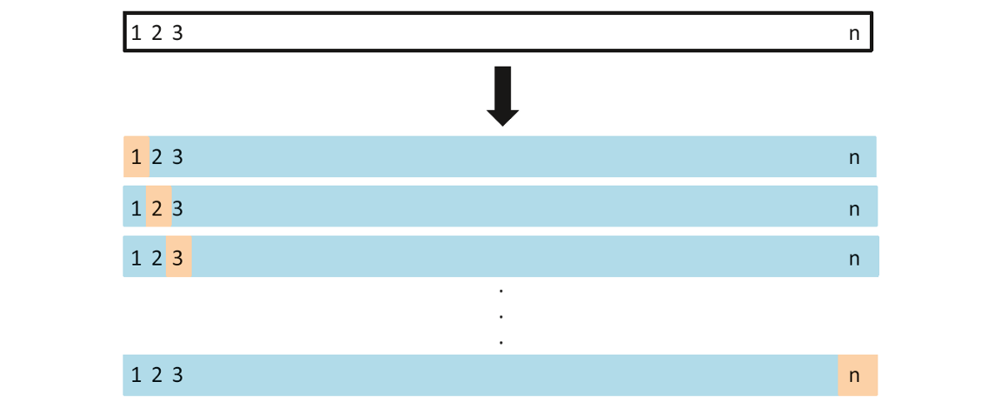

## Resampling Methods
Resampling methods are a process of repeatedly drawing sets from a data and refitting a given model of interest. This helps provide additional information of a desired model for e.g. estimates of test-set prediction error and std dev. and bias of our parameter estimates.

Recollect that training error can be easily calculated by fitting the training data set and it usually follows a decreasing trend on the prediction error as the model becomes more complex. Test error on the other hand usually follows a different trend.

<div class="figure" style="text-align: center">

<p class="caption">Prediction Error vs. Model Complexity[^1]</p>
</div>
  
  
**Cross Validation** steps up here as a means to estimate the test error or an appropriate model flexibility.  
**Model Assesment** is the process of evaluating a model's performance.  
**Model Selection** is the process of selecting an appropriate level of flexibility for the model.  
  
## Cross Validation
In the absence of a large designated ***test*** set, the challenge to estimate the test error can be done via different approaches.

* [Validation Set Approach](#anchor)
* [Leave-One-Out-Cross-Validation (LOOCV)](#anchor2)
* [k-Fold Cross Validation](#anchor3)

### Validation Set Approach {#anchor}
This approach divides the given data set into a training set and a validation (or hold-out) set. Model is fit to the training set and then used to predict output for responses in the validation set. *The validation set error rate is taken as an approximation of the true test error rate.*

<div class="figure" style="text-align: center">

<p class="caption">Validation Set Approach[^1]</p>
</div>

<!--   -->

#### Advantages
This technique has two clear advantages -

* Conceptually Simple
* Easy implementation

#### Disadvantages
The potential drawbacks of this technique include -

* Est. test error rate can be highly variable depending on the selection of the validation set observations
* Est. test error rate tends to be overestimated as the model was trained with fewer obs than it would have if fewer obs were held out for the validation set

The other cross validation approaches seek to rectify these two drawbacks.  
  
### Leave-One-Out-Cross-Validation (LOOCV) {#anchor2}

Similar to the validation set approach, however more robust, this technique withholds only a single observation for the validation set. The process is repeated n times, with each observation being held out for the validation set once in different runs. 

<div class="figure" style="text-align: center">

<p class="caption">LOOCV[^1]</p>
</div>

This yields **n mean-squared errors** which are then averaged to get an approximation of the test mean squared error.

$$ CV_{(n)} =  \frac{1}{n}\ \sum_{i=1}^{n} MSE_i $$

#### Advantages

* Has less bias than validation set approach
* Tends not to overestimate the test mean squared error as more training observations are used in this method (n-1) vs. validation set approach (usually n/2 but not necessarily) 
* This is much less variable (has a rigid estimation of test MSE) as there is no randomness in test splits
* Is a good general method that applies to various modelling methods (logistic, LDA etc.)

#### Disadvantages

* Expensive to implement as the model has to be fit n times (and if n is large or when model is slow to fit)
* Above formula does not always generally hold true and thus model has to be fit n times

### k-fold Cross Validation{#anchor3}
Divide the data set into k folds or groups of equal size. Similar to LOOCV, each of the K folds is used as the validation set, while the other k-1 sets are used as test set to generate k estimates of the test error. The k fold cross validation estimated test error is then an avg of the estimates.

<div class="figure" style="text-align: center">

<p class="caption">k-fold cross estimation[^1]</p>
</div>
Intuitively, LOOCV is a special k-fold cross validation where k=n. However typical values for k is either 5 or 10, in the interest of computational load.

Cross Validation is thus useful in estimating how well a statistical learning procedure would be for new data, and to estimate the minimum point in the estimated test MSE curve. This can be used across different stat models for the same problem or for different levels of flexibility for the same model for the same problem.

$$ CV_{(k)} =  \frac{1}{k}\ \sum_{i=1}^{k} MSE_i $$

### Bias Variance Trade Off for Cross Validation

There is a bias variance trade off component inherent to the choice of k in k-fold CV. k=5 or 10 have been shown to empirically produce test error rate estimates that suffer from neither high bias nor high variance.  
  
**BIAS - ** LOOCV > k-Fold > Validation Set Approach  
**VARIANCE -** k-fold CV ( k < n ) > LOOCV > Validation Set Approach  
  
In LOOCV the n outputs are averaged to get a avg test MSE, each of which have been trained on a similar set of observations. Thus the outputs are highly correlated with each other. In k-fold the overlap of the training sets in each model is smaller than LOOCV.
  
    
## Bootstrap

The bootstrap is a powerful tool that can be used to quantify uncertainty (e.g. std. error) associated with most estimators especially for those where its not easy to obtain a measure of variability.  
  
The bootstrap repeatedly selects small samples from the data-set and estimates the statistic of primary concern for these small samples. The sampling used in bootstrap involves randomly selecting n samples with replacement (meaning some observations can be picked up in different iterations and some may not be picked at all).  
  
The process is repeated B times to obtain B bootstrap data sets, and then used to estimate quantities such as std. error.  
  
Std error of a calculated bootstrap statistic $\hat{a}$ is given by the follows -  
$$ SE_B(\hat{\alpha}) = \sqrt {\frac{1}{B-1} \sum_{r=1}^{B} (\hat{\alpha}^{*r}-\frac{1}{B}\sum_{r'=1}^{B}\hat{\alpha}^{*r'})  }$$
  

##Lab
  
### Validation Set Approach
**Dataset** - Auto  
**Objective** - Use validation set approach to estimate test error rates that result from fitting various models on Auto data-set  

The `set.seed()` function is used to set a start point for R's random number generator. `sample()` is used to split the data set into half, with 196 of 392 observations being picked at random. Note that `sample()` expects integer inputs and here it picks 196 random ints out of 392. So it generates a random index which can be used on the data-set for sub-set purposes.
  

```r
library(ISLR)
attach(Auto)
set.seed(1)
train = sample(392,196)

# Linear Regression of MPG unto horsepower; notice data has been sub-set
lm.fit = lm(mpg~horsepower,data=Auto,subset = train)
```
  
We now go on to predict the mpg for the entire data-set using `predict()`. By using `-train` in the function, we are sub-setting the output for those observations **not** in the training data-set. MSE for the set is calculated using mean function.


```r
mean((mpg-predict(lm.fit,Auto))[-train]^2)
```

```
## [1] 26.14142
```
Thus we see that the estimated test MSE for the linear reg. fit is 26.1414. Next we use the `poly()` function to estimate test MSE for quadratic and cubic regressions. 


```r
lm.fit2 = lm(mpg~poly(horsepower,2),data=Auto,subset = train)
mean((mpg-predict(lm.fit2,Auto))[-train]^2)
```

```
## [1] 19.82259
```

```r
lm.fit3 = lm(mpg~poly(horsepower,3),data=Auto,subset = train)
mean((mpg-predict(lm.fit3,Auto))[-train]^2)
```

```
## [1] 19.78252
```
The results go on to show that higher degrees of predictor yields better test MSEs; however the improvement from quadratic to cubic is very small.  
  
Now recollect that the point made above in the bias variance trade off section, where it was specified that Validation Set Approach is inferior in terms of variability of results. This can be demonstrated by picking a different data subset/split and repeating the above steps.  


```r
set.seed(2)
train = sample(392,196)

lm.fit = lm(mpg~horsepower,data=Auto,subset = train)
mean((mpg-predict(lm.fit,Auto))[-train]^2)
```

```
## [1] 23.29559
```

```r
lm.fit2 = lm(mpg~poly(horsepower,2),data=Auto,subset = train)
mean((mpg-predict(lm.fit2,Auto))[-train]^2)
```

```
## [1] 18.90124
```

```r
lm.fit3 = lm(mpg~poly(horsepower,3),data=Auto,subset = train)
mean((mpg-predict(lm.fit3,Auto))[-train]^2)
```

```
## [1] 19.2574
```

For this split we see that the test MSE has gone down from *(26.14, 19.82, 19.78)* to *(23.30, 18.90, 19.26)*. The second run shows that while a quadratic transform of `horsepower` yields better results than linear, there is little evidence from improvement on cubic functions of `horsepower`. 

### Leave-One-Out Cross-Validation
LOOCV estimate can be calculated using the `cv.glm()` function. However `glm()` function is to be used for the linear function instead of `lm()` as it is compatible with `cv.glm()`. `glm()` and `lm()` yield the same fit (coef, intercepts for linear etc.) for given predictor for a given response.  
`cv.glm()` is part of the `boot` library.


```r
library(boot)
glm.fit = glm(mpg~horsepower, data = Auto)
cv.err = cv.glm(Auto,glm.fit)

cv.err$delta
```

```
## [1] 24.23151 24.23114
```
Output of `cv.glm()` is a list. The two numbers in the `delta` vector contain the cross validation result. While the numbers are same in this case, it may not always be. Our CV estimate for the test MSE is approx. 24.23.

We will now obtain the estimate recursively for higher polynomial fits.


```r
cv.error = rep(0,5)
for(i in 1:5){
  glm.fit = glm(mpg~poly(horsepower,i), data = Auto)
  cv.error[i] = cv.glm(Auto,glm.fit)$delta[1]
}
cv.error
```

```
## [1] 24.23151 19.24821 19.33498 19.42443 19.03321
```
Here we see that the improvement is high between linear and quadratic fits; but no clear improvement from using higher-order polynomials.

### k-Fold Cross-Validation
The `cv.glm()` function can be used to perform k-fold CV. This is going to be computationally faster than the LOOCV method.


```r
set.seed(17)
cv.error.10 = rep(0,10)
for(i in 1:10){
  glm.fit = glm(mpg~poly(horsepower,i), data = Auto)
  cv.error.10[i] = cv.glm(Auto,glm.fit,K=10)$delta[1]
}
cv.error.10
```

```
##  [1] 24.20520 19.18924 19.30662 19.33799 18.87911 19.02103 18.89609
##  [8] 19.71201 18.95140 19.50196
```
A note about the two numbers in the delta part of the `cv.glm()` list is that the two numbers differ slightly in k-fold CV. The second number is actually a bias corrected version of the first number. On this data-set the two numbers are pretty similar.

### The Bootstrap
Bootstrap is a simple technique that can be applied to all situations. Performing it requires 2 steps - 

#### Estimating Accuracy of a Single Statistic

* Create a function that computes the stat of interest (`alpha.fn()` in the following example)
* Use the `boot()` function from the `boot` library to perform the bootstrap by repeatedly sampling observations from the data with replacement. 

The following is to create a function that takes as input (X,Y) data as well as a vector that represents the observations in data. It shows an estimate of $\alpha$ using all 100 observations in `Portfolio` data-set.

```r
alpha.fn = function(data,index){
  X=data$X[index]
  Y=data$Y[index]
  return(
    (var(Y)-cov(X,Y))/(var(X)+var(Y)-2*cov(X,Y))
  )
}

alpha.fn(Portfolio,1:100)
```

```
## [1] 0.5758321
```
Now lets repeat the process but with a random replaced sample of 100 observations using `sample()` function.

```r
set.seed(1)
alpha.fn(Portfolio, sample(100,100,replace=TRUE))
```

```
## [1] 0.5963833
```
A bootstrap analysis can be established by performing this command many times, recording all estimates for $\alpha$ and computing the resulting std. deviation. The `boot()` function helps automate this objective. Below we produce R = 1000 bootstrap estimates for $\alpha$.


```r
boot(Portfolio, alpha.fn, R=1000)
```

```
## 
## ORDINARY NONPARAMETRIC BOOTSTRAP
## 
## 
## Call:
## boot(data = Portfolio, statistic = alpha.fn, R = 1000)
## 
## 
## Bootstrap Statistics :
##      original        bias    std. error
## t1* 0.5758321 -7.315422e-05  0.08861826
```
This output shows that using original data, $\hat{\alpha}$ is 0.5758 and bootstrap estimate for $SE(\hat\alpha)$ is 0.0886.

#### Estimating Accuracy of a Linear Regression Model

The bootstrap approach can be used to est. the variability of the coef estimates and predictions from statistical learning methods.Lets try this on a linear regression model that uses `horsepower` to predict `mpg` in the `Auto` dataset. We will compare estimates using bootstrap to those from the formulae to calculate $SE(\hat\beta_0)$ and $SE(\hat\beta_1)$.


```r
boot.fn = function(data,index)
  return(coef(lm(mpg~horsepower,data = data, subset = index)))

boot.fn(Auto,1:392)
```

```
## (Intercept)  horsepower 
##  39.9358610  -0.1578447
```
Now use the `boot.fn()` to create bootstrap estimate ot the intercept and slope, by randomly sampling from among observations with replacement.

```r
set.seed(1)
boot.fn(Auto,sample(392,392,replace=TRUE))
```

```
## (Intercept)  horsepower 
##  38.7387134  -0.1481952
```

```r
boot.fn(Auto,sample(392,392,replace=TRUE))
```

```
## (Intercept)  horsepower 
##  40.0383086  -0.1596104
```
Next we use `boot()` to estimate the stde errors of 1000 bootstrap estimates for intercept and slope.

```r
boot(Auto,boot.fn,1000)
```

```
## 
## ORDINARY NONPARAMETRIC BOOTSTRAP
## 
## 
## Call:
## boot(data = Auto, statistic = boot.fn, R = 1000)
## 
## 
## Bootstrap Statistics :
##       original      bias    std. error
## t1* 39.9358610  0.02972191 0.860007896
## t2* -0.1578447 -0.00030823 0.007404467
```

```r
summary(lm(mpg~horsepower, data= Auto))$coef
```

```
##               Estimate  Std. Error   t value      Pr(>|t|)
## (Intercept) 39.9358610 0.717498656  55.65984 1.220362e-187
## horsepower  -0.1578447 0.006445501 -24.48914  7.031989e-81
```

The reason for difference in the SE calculated by bootstrap vs the summary of lm() is because lm() makes 2 assumptions which are not always correct. The bootstrap estimate of SE is a superior est. of SE.

* Standard formula to calculate SE relies on $\sigma^2$ which relies on the linear model being right. In this case, we know there is non-linearity between mpg and horsepower
* Standard formula assumes all variability comes from variation in the error terms $\epsilon_i$

Finally lets perfrom bootstrap on the more accurate fit of mpg on horsepower^2. Since the model is more apt, there is better sync between bootstrap estimates and standard estimates of std. error.


```r
boot.fn = function(data,index)
  coefficients(lm(mpg~horsepower+I(horsepower^2), data = data, subset = index))
set.seed(1)
boot(Auto,boot.fn,1000)
```

```
## 
## ORDINARY NONPARAMETRIC BOOTSTRAP
## 
## 
## Call:
## boot(data = Auto, statistic = boot.fn, R = 1000)
## 
## 
## Bootstrap Statistics :
##         original        bias     std. error
## t1* 56.900099702  6.098115e-03 2.0944855842
## t2* -0.466189630 -1.777108e-04 0.0334123802
## t3*  0.001230536  1.324315e-06 0.0001208339
```

```r
summary(lm(mpg~horsepower+I(horsepower^2), data=Auto))$coef
```

```
##                     Estimate   Std. Error   t value      Pr(>|t|)
## (Intercept)     56.900099702 1.8004268063  31.60367 1.740911e-109
## horsepower      -0.466189630 0.0311246171 -14.97816  2.289429e-40
## I(horsepower^2)  0.001230536 0.0001220759  10.08009  2.196340e-21
```


[//]: (Footnotes)
[^1]: [Resampling Methods](https://medium.com/analytics-vidhya/resampling-methods-statistical-learning-8c3da6fe6d24)
